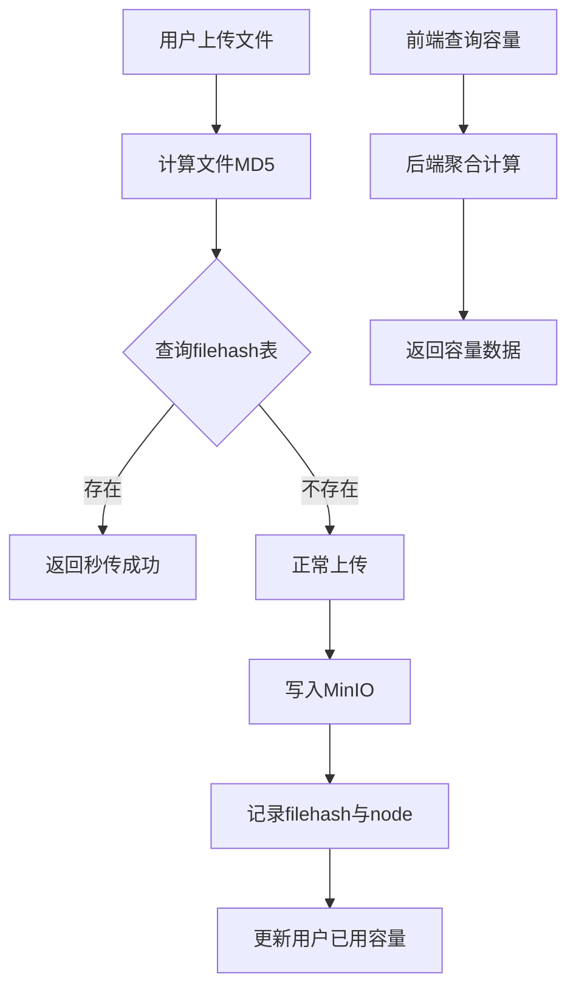

## Product Overview

为GoPan网盘系统实现全面的容量管理与用户体验优化，包括用户容量控制、文件秒传机制、前端可视化展示及代码结构优化。

## Core Features

- **容量管理**：新用户注册默认10GB容量，管理员可动态调整用户容量配额
- **文件秒传**：基于MD5校验实现秒传，上传时优先检查filehash表
- **容量统计**：基于filehash和node表聚合计算用户已用容量
- **可视化展示**：前端以进度条和数字形式直观展示容量使用情况
- **代码重构**：将公用JavaScript逻辑抽离为独立模块，提高代码复用性

## Tech Stack

- 后端框架：Go + Gin
- ORM：Ent
- 数据库：PostgreSQL
- 对象存储：MinIO
- 前端：HTML + TailwindCSS + 原生JavaScript

## Tech Architecture

### 系统架构

采用分层架构模式，保持现有项目结构。

- 控制层：处理HTTP请求，验证用户权限
- 业务层：容量计算、秒传判断逻辑
- 数据层：通过Ent操作PostgreSQL

### 模块划分

- **用户容量模块**：管理用户容量配额设置与查询
- **文件秒传模块**：基于MD5判断文件是否存在
- **容量统计模块**：聚合计算用户已用容量
- **公用模块**：前端API请求、工具函数抽离

### 数据流



### 核心数据结构

**UserSchema扩展**：增加容量相关字段

```
// 用户表扩展字段
TotalUsed   int64  // 已用容量(字节)
TotalQuota  int64  // 总容量配额(字节)
```

**FileHash表**：已存在，包含MD5、文件大小、MinIO对象信息

```
// 利用现有结构
type FileHash struct {
    Hash       string // MD5
    Size       int64  // 文件大小
    MinioObject string
}
```

### 关键实现逻辑

**秒传检查流程**：

1. 接收客户端上传请求，包含MD5和文件大小
2. 查询filehash表中是否存在该MD5
3. 若存在，直接关联node表记录，无需上传实体文件
4. 若不存在，执行正常上传流程

**容量统计策略**：

- 不遍历MinIO，避免性能问题
- 查询node表获取用户所有文件节点
- 关联filehash表获取文件实际大小
- 聚合Sum计算总已用容量

## 实现细节

### 目录结构

```
project-root/
├── internal/
│   ├── handler/
│   │   ├── capacity.go      # 新增：容量相关API
│   │   └── upload.go         # 修改：集成秒传逻辑
│   ├── service/
│   │   ├── capacity.go      # 新增：容量业务逻辑
│   │   └── upload.go         # 修改：秒传判断
│   └── schema/
│       └── user.go           # 修改：增加容量字段
├── web/
│   ├── static/
│   │   ├── js/
│   │   │   ├── api.js        # 新增：API请求封装
│   │   │   ├── utils.js      # 新增：工具函数
│   │   │   └── upload.js     # 重构：秒传逻辑
│   │   └── css/
│   └── templates/
│       └── components/
│           └── capacity.html # 新增：容量展示组件
```

### 技术实现计划

**1. 数据库迁移**

- 为User表添加total_used和total_quota字段
- 设置默认total_quota为10GB (10737418240字节)

**2. 后端API设计**

- GET /api/capacity/info：获取当前用户容量信息
- PUT /api/admin/capacity/:userId：管理员调整用户容量
- POST /api/upload/check：检查文件是否支持秒传

**3. 前端重构**

- 抽离`api.js`：统一fetch请求封装，处理token和错误
- 抽离`utils.js`：格式化文件大小、日期等公共函数
- 修改`upload.js`：上传前先调用check接口，支持秒传
- 新增容量组件：在各页面头部展示容量进度条

### 集成点

- 上传接口需兼容现有流程，增加秒传分支
- 容量计算需在文件上传/删除/移动/恢复时触发更新
- 前端各页面需引入重构后的公用JS模块

### 技术考虑

- **性能优化**：容量统计使用SQL聚合，避免多次查询
- **并发控制**：秒传检查需加锁，防止重复上传
- **前端缓存**：容量信息可做短暂本地缓存，减少请求频率

## 设计风格

采用简洁、现代的网盘界面风格，参考百度网盘设计语言，强调信息清晰与操作便捷。使用TailwindCSS构建响应式布局，确保在不同设备上均能良好展示。

## 页面规划

1. **主页面头部**：新增容量展示条，贯穿所有功能页面
2. **上传弹窗**：优化秒传提示，展示上传进度与秒传状态
3. **管理后台**：管理员用户列表增加容量调整入口

## 单页面块设计

**头部容量条 (所有页面共用)**

- 顶部导航栏右侧集成容量显示区域
- 展示进度条：已用/总容量，绿色为安全，80%以上变橙色，95%以上变红色
- 鼠标悬停显示具体数值："已用 2.5GB / 总量 10GB"
- 点击"扩容"按钮（普通用户引导联系管理员，管理员可弹窗调整）

**文件上传区域**

- 上传窗口增加"极速秒传"动画图标
- 秒传成功时显示绿色对勾动画，0.5秒后自动关闭
- 普通上传保留原有进度条设计

**用户管理页面 (管理员)**

- 用户列表增加"容量配额"列
- 点击容量数字弹出修改对话框
- 输入框支持GB/MB单位自动换算

## Agent Extensions

### SubAgent

- **code-explorer**
- Purpose: 探索项目现有代码结构，了解user schema、filehash表及上传逻辑
- Expected outcome: 明确当前数据库结构、上传流程和前端JS组织方式，为后续开发提供准确依据